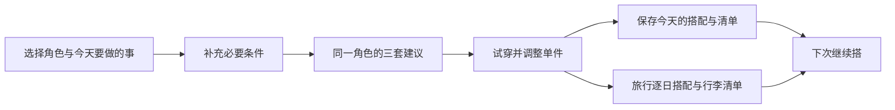

# 今天怎么穿：出门需求与可组合衣橱设计

日期：2026-10-02。状态：方向已获确认，本文为待审阅的书面设计，尚未开始实现或制作新服装素材。

## 1. 这轮要完成的产品

用户打开网站，说明今天准备做什么，在自己选中的角色身上看到适合的搭配；保留喜欢的单品，修改不满意的部分，最后得到能参考着穿出门的清单。旅行用户还能得到每天的搭配和去重行李清单。

两个主要问题一起解决：入口围绕真实出门需求展开，衣橱从固定整套图片改成可组合的单品。增加季节按钮、对比两套衣服、更多拍照效果，均不能单独完成这轮目标。

三位角色的当前姓名、已确认的面貌、发型、妆容、青春感及约3.8头身的比例继续使用：吴心媛（sweet）、陈墨白（cool）、顾书宁（literary）。性格影响推荐排序，但任何角色都可以约会、上课或旅行。推荐不会为了找到一套衣服而替用户换人。

保持2D、简约大气、无衬线、少说明多展示。摄影棚纯色背景仍为默认；生活背景、动作和拍照是完成穿搭后的辅助体验。成片不绘制姓名、OOTD或其他文字。

### 明确的能力边界

- 提供服装风格、颜色、组合及出行准备参考；三位卡通角色的穿着画面不代表用户真实身材的尺码、合身程度或物理布料效果。
- 首版采用人工审美审核的素材及搭配规则，所有推荐单品都真实存在于衣橱。点击按钮即时生成的是有效组合，不是联网生成新服装图片。
- 首次交付完整功能预览，现有正式网站和此前预览继续保留。用户确认该功能预览后，再讨论正式替换与发布。

## 2. 方案选择与首轮交付范围

可选方式有继续增加整套图、制作可组合的2D单品、或实时生成任意穿搭。采用第二种：整套图难以锁定一件裤子只换鞋，实时生成会引入等待、身份不稳定及持续费用；单品需要前期素材工作，但更适合持续调整同一个人物的衣橱。

本轮完整功能预览包括以下连续体验，不以增加一两个按钮作为完成标准：

1. 九类出门需求及对应条件；季节和冷暖作为条件。
2. 三位角色，50款设计的单品衣橱，每人可用30款。
3. 三套首次推荐、手动换单件、锁定单件后重新搭配、明确排除不喜欢的品类。
4. 单日方案保存、重新打开编辑、同类实物标记及实际搭配清单。
5. 1—7天旅行的逐日搭配与去重行李清单。

服装参考确认和分层渲染验证是内部建设步骤。完整交付仍包含上述五项，不把少量测试素材称为完整衣橱。

账户、购物链接、实时天气、上传实物识别、自由绘制服装、男性角色、社交动态及游戏任务不在首轮。网站静态本地运行，不需要新服务器才能体验核心流程。

## 3. 用户从进来到完成的顺序

首次打开显示默认吴心媛全身和一个清晰入口“今天要做什么”。角色选择紧邻画面，三人头像与姓名保持可见。回访保留上次角色与用户主动保存的偏好，不静默恢复正在加载的临时穿搭。

首次人物穿着该角色第一套已审核的完整分体造型，不展示缺少衣物的基础板。用户主动换人时需求条件保留，恢复目标角色自己的最近有效造型及锁定项；每人的锁定分别保存，不把一人的专属衣服或锁定带到另一人身上。尚无草稿的角色使用自己的审核默认装扮。

主画面始终是人物。右侧主要操作依次为当前需求摘要、服装分类、当前单品、保存方案。季节、背景、动作、灯光、身体比例不再同时挤成多排主要按钮。

- **选需求时**：打开一个轻量面板，展示九张简洁文字卡片，不用九张复杂场景图抢人物的注意力。完成后收成一行摘要，例如“约会 · 看展 · 温暖 · 走路较多”。
- **看建议时**：三张同一角色全身搭配图。点击“试穿”才采用，浏览候选不会改变当前装扮。候选变化至少涉及两件可见主要单品；仅改包或颜色细节不算一套新的主要建议。
- **调单品时**：分类为上衣、下装、连衣裙、外套、鞋、包；袜类跟随下装/裙装选择。每次只展开一个分类，缩略图就是具体单品。当前穿着带选中态，锁定用小锁图标表达。
- **完成时**：主按钮是“保存搭配”；“拍一张”是次级操作。保存后显示单品清单及“继续调整”，照片不承担全部产品价值。
- **可直接搭配**：用户也能跳过需求从“直接逛衣橱”开始。保存前可补充用途，没有用途时保存为自由搭配。

默认使用摄影棚。生活场景由“背景”入口主动选择；推荐约会或旅行不自动切换背景。外景采用已确认的环境光，摄影棚才展示室内灯光工具。

## 4. 九类出门需求与条件

入口名称与顺序按用户最新要求固定为：上课、上班、约会、聚会、演出、逛街、短途旅行、长途旅行、景点打卡。聚会和演出各自独立，上班不附加实习标签；具体条件在选择入口后展开。

| 入口 | 只在需要时追问 | 推荐重点 |
| --- | --- | --- |
| 上课 | 普通上课／有展示或汇报 | 方便行动、学习用品容量；汇报时增加整洁度 |
| 上班 | 休闲办公／需要整洁正式 | 整洁、活动方便；不默认所有工作都穿西装 |
| 约会 | 咖啡散步／看展／吃饭 | 场合氛围、个人风格、走路量 |
| 聚会 | 朋友聚会／稍正式的聚会 | 社交氛围与个人风格；根据场合调整整洁度 |
| 演出 | 站立观看／坐席观看 | 表达个性；站立活动优先合适的鞋与便携包 |
| 逛街 | 室内商场／户外街区 | 舒适、轻便、可增减外层 |
| 短途旅行 | 1—3天，城市／海边／轻户外 | 少带衣物、多种组合、日常步行 |
| 长途旅行 | 4—7天，同类目的地与轻装偏好 | 每日用途、衣物复用、行李去重 |
| 景点打卡 | 城市街区／古镇／海边／自然公园 | 场景配色、活动需求；仍在普通休闲出行范围 |

“自然公园／轻户外”指日常游览，首批衣橱不提供登山、冰雪或专业运动装备搭配。超过7天的行程提示首版范围，保留已填信息，不假装生成完整长行程。

共同条件保持简短：季节、冷暖（热／温暖／凉／冷）、走路量（少／普通／多）。默认春温暖、夏热、秋凉、冬冷，用户可以覆盖；冷暖由用户选择，不请求定位或自动获取天气。活动子项提供默认走路量，用户可改。

风格偏好和“不穿裙子／只用有类似实物的单品”放在可展开的偏好入口。首次不要求填写年龄、性别、体重或冗长问卷。旅行额外显示天数、每天用途与“尽量少带”，不会强迫普通上课用户配置行程。

单日用途默认采用表格中的第一个子项；短途默认2天、长途默认4天，目的地默认城市。风格默认跟随所选人物，可主动改为清爽休闲、利落街头、温柔轻盈或清新整洁。风格是排序偏好，不改变角色身份，也不取消出行条件。

## 5. 首批50款衣橱及供应方式

具体名称、颜色和设计方向见同目录的 [首批衣橱CSV](2026-10-02-outfit-planner-wardrobe.csv)。这是制作清单，不是已完成的服装素材。

| 单品类型 | 通用 | 吴心媛专属 | 陈墨白专属 | 顾书宁专属 | 合计 |
| --- | ---: | ---: | ---: | ---: | ---: |
| 上衣 | 5 | 2 | 2 | 2 | 11 |
| 下装 | 4 | 2 | 2 | 2 | 10 |
| 连衣裙 | 0 | 2 | 0 | 1 | 3 |
| 外套 | 3 | 1 | 3 | 2 | 9 |
| 鞋 | 5 | 2 | 2 | 2 | 11 |
| 包 | 2 | 1 | 1 | 1 | 5 |
| 打底袜 | 1 | 0 | 0 | 0 | 1 |
| **合计** | **20** | **10** | **10** | **10** | **50** |

每人看到通用20款及自己的10款，共30款。专属单品首批按角色制作，不跨角色穿上未经适配的素材。通用服装的设计相同，但必须逐人验证版型、皮肤遮挡、发型与头身比例；不能直接把同一张图片平移贴到三个人身上。

50款设计需要至少90个角色适配记录（20×3＋30），并可能包含前后层、袖子及遮罩。适配记录不等于90张最终图片，实际图层数在素材分层验证后确定；不按“50款”低估素材成本。

### 三种风格的区别

- **吴心媛**：柔和色彩、小圆领、轻盈裙装，也有灯芯绒裤与基础长裤。专属鞋用玛丽珍与麂皮短靴，通用凉鞋和轻运动鞋覆盖其他需求。
- **陈墨白**：水洗T恤、短皮夹克、工装裤、牛仔短裤、机能外套和直线大衣。春秋通过外套长度、材质、裤型区分；鞋包括德比、皮凉鞋、帆布鞋、运动鞋与短靴，不把“酷”缩成全年皮靴。
- **顾书宁**：轻薄翻领、细格衬衫、卡其短裤、绿色短裙、背带裙和开衫。夏季有明确的短裤与无袖轻上衣；知性由清新整洁的组合表达，保留年轻感。

四季不再各锁死两套。冷暖先过滤组合：同一衬衫可以夏季配短裤，也可凉天配长裤与外套。已有24套完整图继续留在原预览作为已确认的历史造型，不假装它们已拆成单品。

### 制作与确认

先做三位角色的同姿态基础板及代表性单品搭配参考，展示轮廓、层叠、鞋款与各自气质。面貌引用已确认形象，吴心媛脸部不重新设计。分层基础板可能需要调整手臂的站姿，但人物的脸、发型、体型及比例不得漂移。

代表样通过后按角色出成组衣橱参考，再补齐50款设计。新服装与新的基础姿态均先给用户视觉确认，确认之后才接入功能预览。用户的服装建议作为开放方向，参考中主动提供不同材质、轮廓及鞋类。

后续增加一件衣服的过程固定为“设计参考 → 用户确认 → 对应角色适配 → 有效组合审核 → 上架衣橱”。新增单品必须能与旧衣橱组成至少3套明显不同的有效搭配，否则不作为首批新内容入口。没有真实新素材时不显示“新品已上架”。

## 6. 真正换单件所需的2D素材与渲染

现有 `previews/studio-first/renderer.js` 以整个人物PNG或整套姿态图为源。它能替换整套，不能只换一件鞋并保留所有裤型。新系统建立独立的分层合成，不能用旧整套切换冒充模块化衣橱。

### 素材约定

- 使用统一1024×1536参考画布、身体锚点和站立足底线；画面展示及导出都使用同一套合成结果。
- 每人独立基础板：后发、头部/表情、身体与四肢、前发。基础躯干有不外露的安全内层，不提供裸露角色素材或相关操作。
- 服装提供独立透明图层；外套、包带、手臂可能需要拆成后层和前层。人物手部与衣袖使用对应遮挡，不直接把包覆盖在整只手外面。
- 每件单品记录锚点、允许姿态、遮挡模板、角色/素材版本。上衣的下摆与下装腰部接缝要有逐对验证；鞋与裤脚也记录兼容组合。
- 固定绘画光向、阴影与材质风格。透明背景不能自带与当前摄影棚冲突的地面或暖光晕。组合完成后统一应用当前环境光与接触阴影。

基准绘制顺序是后发与包后层、身体底层、贴身内层/袜、下装、上衣、外套后层、鞋、衣袖与手臂、外套前层、包前层、头部、前发。实际采用经过审核的模板排序；例如长裤脚可能盖住鞋上沿，模板可调整对应局部层位，不能用一个错误顺序覆盖所有款式。

### 穿衣规则

- 常规上衣＋下装，或连衣裙二选一。切换普通连衣裙时移除上衣与下装；回到分体装恢复本角色最近的有效分体选择。
- 顾书宁背带裙明确允许规定衬衫内搭，由 `requiresTop` 与内搭允许列表表达；普通连衣裙不自动叠加衬衫。
- 外套、包、打底袜可移除，鞋为必需项。冷天裙装若规则要求打底袜，应作为候选的显式单品列出；用户移除时保留手动造型，但不再标记为该冷天需求的合适推荐。
- 第一批不提供开闭拉链、卷袖动画、任意塞衣角等形态切换。需要这些视觉状态时制作新的明确变体，不靠拉伸图片伪造。
- 手动衣橱只展示已通过视觉兼容校验的候选。可以手动搭出不适合当前出行条件的组合，但保存时用一句短提示指出原因；推荐不会把这种组合当成适合的结果。

### 动作与比例

旧的全身动作素材带着固定衣服，不能在新衣橱中播放，否则一眨眼或挥手就回到旧套装。新预览首轮提供适配基础站姿的呼吸、眨眼和不改变手臂结构的表情变化，使用同一已确认头部素材。

抬手、比心、交叉手臂等必须补齐对应服装袖层和遮罩后才能加入新衣橱。没有兼容素材时不显示该动作入口，也不换回旧装扮。此前预览的所有动作继续存在。新产品先完成自由换装，完整全身动作作为后续明确的素材扩展。

新预览初期固定已确认身体比例，不加入变高、变胖瘦等拉伸控件；否则会同时破坏衣服贴合与实用参考。角色切换使用各自审核的基础板，头部不随换装再次生成。

合成器的视觉兼容允许表和推荐器的出行适合规则分别管理：没有视觉兼容的单品组合不会进入手动试穿；视觉正确但用途不合适的组合可以手动保留。这样既不把“允许穿上”误说成“适合今天”，也不靠过滤季节隐藏素材穿帮。

## 7. 推荐、锁定与“都不喜欢”的处理

首批推荐由可解释的本地规则完成，不依赖聊天模型或外部服务。单品标注冷暖、材质、轮廓、颜色、场合、走路支持程度、包容量与角色风格；CSV中的冷暖是设计用途，最终必须通过组合审核才能成为推荐。

推荐分为两步：先筛有效组合，再排序。

1. **硬条件**：当前角色有可用素材；图层/腰部/鞋裤兼容；保留锁定项；遵守“不穿裙子”等排除项；满足用户选定的用途与冷暖；“只用类似实物”开启时只能使用已标记项。
2. **排序**：场合贴合度、角色或用户指定风格、配色与轮廓、活动舒适度、类似实物优先、近期未见或未采用。首先满足需求，再考虑新鲜感。各维度为编辑配置，不能把低适配度用“新鲜”分数补回来。

推荐样本先由人工审核形成组合模板，例如短裤轻上衣、长裤针织外套、裙装袜鞋外套。模板允许经审核的单品替换，只有兼容规则允许才参与组合。不会将50款的数学乘积宣传为全部好看的搭配。

### 四种调整

| 用户意图 | 操作 | 结果 |
| --- | --- | --- |
| 喜欢裤子，其他不满意 | 锁住裤子，点“再搭一组” | 人物和裤子保持，变化其他未锁项 |
| 只想换鞋 | 打开鞋分类 | 展示当前组合可用的鞋，明确点击后只替换鞋 |
| 整体风格不喜欢 | 改风格或排除品类，再搭一组 | 用现有真实单品重排，人物不变 |
| 建议都不喜欢 | 直接逛衣橱 | 逐件自主试穿；仍能保存、列清单 |

“再搭一组”优先改变至少两件未锁的主要单品；若用户锁到只剩鞋，可只改鞋，不强迫解锁。候选以单品ID集合去重，同一请求内不连续展示同一组合。候选耗尽时显示“这些条件下的搭配已看完”，给出继续手动搭配或放宽条件入口，不假装还有无限新衣服。

若条件无解，不擅自解锁、取消排除或换人。优先给出具体的最小修正，例如“这双凉鞋不适合当前冷天条件，可换鞋或改冷暖”。当前画面与已锁单品保留，由用户选择。不可用图片加载失败也不能成为推荐结果。

## 8. 和真实衣橱的连接与最终产出

每张单品卡允许标记“我有类似”。这里只表示用户自述拥有类似款，不宣称网站知道其真实衣服、材质或尺码。初次不标记也能用完整衣橱，标记后推荐优先采用对应款式；可以开启“只用类似实物”。严格模式没法组成一身时说明缺少的类别，不自动把没有的衣服当已有。

保存方案记录实际采用的单品。结果区只放必要内容：

- 今天的用途与条件、角色全身图。
- 上衣、下装或裙、外套、袜、鞋、包的具体款式与颜色；无外套或包时不虚构一件。
- 对每件已采用单品可打开最多两个已验证的替代项，点击可在同一人物上试穿；衣橱没有替代时如实显示。
- “我有类似”状态和自己起的方案名。保存后可重新打开调整并另存或覆盖，覆盖需要用户明确选择。

搭配清单与照片分开保存；没拍照也有可用方案。照片只是无字成片。首版不添加未核实的商品购买链接，也不因服装颜色相同而宣称用户能获得完全相同的上身效果。

## 9. 旅行模式

短途1—3天，长途4—7天。用户选天数与目的地后，默认各天沿用整体冷暖，可逐日修改用途、冷暖和走路量。没有专业运动或极端天气装备的需求不伪装为支持。

每一天仍是一套可单件调整的搭配。锁定某天裤子只约束当天；“此件贯穿行程”是另一项明确选择。换一天不丢失其他天的编辑内容。

生成全行程时综合考虑满足每天需求、重复使用外套/鞋/包、减少携带件数以及避免连续两天完全同一套。偏好“尽量少带”时允许重复穿整套，但需用户主动选择；不能为了少带衣服覆盖冷暖或活动约束。衣物复用不自动承诺清洗或卫生安排，用户可以把某件设为不复用。

行李清单按单品ID去重，显示款式、颜色、数量、使用日期；标记“第一天穿在身上”的单品不重复计入行李中的件数。袜等需要多份的物品数量由用户调整，不把复用一条裤子误算成每天都需带一条同款裤子。行李箱本身不绘制为角色的搭配包。

每日方案可以分别重新推荐；整组修改需保留所有已锁日程与单品。剩余供给不足时指出无法满足的日期或条件，不凭空增加单品。保存和重新打开包括每日状态与行李清单。

## 10. 为什么有理由回来

回访入口仍围绕今天的用途，不设置签到、积分或为了停留而堆游戏。

- 以前是上课，今天要约会：用同一已标记单品搭出另一种组合。
- 最近穿过的造型：主动标为已采用后，下一次推荐在需求匹配的前提下优先其他组合。
- 一件特别喜欢的裤子：锁住它，继续寻找不同上衣与鞋。
- 已保存旅行或出门方案：改日期、条件和单件后复用，不必从头开始。
- 衣橱确实上架新单品后：展示它与用户旧收藏/类似实物能形成的搭配；没有更新不显示假的每日新品。

这里的回访效果是待验证假设。看过建议、试穿过与实际采用分开记录；刷新页面不算实际采用。不用推送、自动定时任务或外部追踪换取回访。

## 11. 预览隔离、数据与模块边界

新功能预览使用 `previews/wardrobe-planner/`。当前 `previews/studio-first/` 是对照入口；新模块不反向重写其生成器或替换其中24套图片。

| 模块 | 负责内容 | 依赖与输出 |
| --- | --- | --- |
| 单品目录 | 可用款式、角色适配、图层与兼容版本 | 提供单品与适配查询；不负责推荐或UI |
| 需求模型 | 九类用途、必要条件、旅行日期 | 验证并规范化需求；不改人物 |
| 搭配规则 | 硬条件、模板、去重与排序 | 输入需求/角色/锁定/偏好，输出有效组合或无解原因 |
| 分层合成器 | 基础板、服装层、遮挡、统一光线 | 输入完整有效造型与场景，输出画面及导出源 |
| 试穿控制器 | 当前已显示造型、候选、异步加载 | 资源准备成功后一次提交，保持用户最新选择 |
| 旅行规划 | 逐日条件、单品复用、行李去重 | 调用同一搭配规则，不另建一套推荐逻辑 |
| 方案存储 | 单日/旅行方案、类似实物、近期采用 | 独立本地数据库，不操作旧照片数据库 |
| 界面 | 需求入口、衣橱、候选、保存与清单 | 通过上述接口操作，避免复制业务规则 |

沿用静态网页和现有Canvas能力，不在本轮为规划引入新的框架或后台。实现规划再将接口拆成具体文件与检查任务。

数据约定：

- 单品：稳定 `itemId`、分类、所属范围、标签、适配与视觉兼容版本。
- 角色适配：`characterId + itemId + assetVersion` 对应可加载图层、锚点、遮挡与姿态能力。
- 单日方案：`schemaVersion`、角色、需求、单品ID、锁定、素材/规则版本、类似实物状态、场景及保存时间。
- 旅行方案：整体需求、每天的上述方案、复用限制、行李数量与穿在身上状态。
- 存储命名：会话 `studio-wardrobe-planner-v1`，数据库 `nieve-wardrobe-planner-v1`。历史照片、旧会话和此前偏好键不迁移或改写。

加载候选时继续显示上一套完整造型；全部资源成功后原子替换。快速换鞋、切人、关闭候选时取消旧请求的提交资格，避免过期结果覆盖新选择。读取失败可重试，失败不会抹掉上一套。只缓存已合成的有限候选及当前所需图层，不启动时解码全部90个适配记录。

存储空间不足时保持当前编辑，提示保存失败并允许导出清单；不清空旧收藏。缺失旧素材版本时保留方案数据与预览快照，列明缺失项，不自动替换为别的角色。数据库升级使用显式版本处理。

## 12. 建设顺序与完整交付标准

### 顺序

1. **书面方案确认**：本设计及50款清单；下一步把完整目标拆成实施计划，不反复重提产品方向。
2. **素材技术验证与视觉确认**：三人同姿态基础板；用衬衫、长裤、裙、外套、鞋、包验证腰部、袖子、裤脚、长发与手部。产出真实合成图，不靠截图中的固定整套替代。
3. **核心功能建设**：用途 → 同角色建议 → 锁定/换单件 → 保存与清单。技术上用少量已确认的素材做贯通，但作为建设过程展示，不宣称完整产品已完成。
4. **衣橱与旅行补齐**：完成50款的90个适配记录、审核有效组合，完成逐日搭配与行李清单；交付可用的完整预览。
5. **用户实际体验后再安排优化**：根据卡点调整交互，再做手机实机验收、分享、性能与成片精修。不能先花多轮时间抛光未完成的核心流程。

最大的工作量是素材适配和组合审美审核。先验证最难的重叠关系再批量生产，避免生成大量整套图后才发现仍不能换单件。阶段用具体产物报告进展，未跑过的功能不写“已完成”。

### 功能与内容验收

| 验收项 | 通过条件 |
| --- | --- |
| 角色与衣橱供给 | 名称/形象正确；每人30款实际可用，共50款设计；90个适配记录均通过渲染核对 |
| 四季与用途覆盖 | 三人 × 热/温暖/凉/冷 × 九类用途的默认条件均有至少3套审美审核通过的不同建议；旅行按默认城市日常条件检查 |
| 真实调整空间 | 每人至少30套审核过的不同可组合造型，且各冷暖至少6套；不是换背景或只换包来凑数。用途可共享合适造型，不要求为每种用途重复画衣服 |
| 单件换装 | 锁定裤子后至少能演示3组上衣/外层/鞋的不同搭法；只换鞋不改变人物、裤子、头部或背景 |
| 排除与锁定 | 不穿裙子、严格类似实物、多个锁定及无解场景如实处理；候选耗尽不循环冒充新品 |
| 合成质量 | 头身比例不漂移；袖手、腰线、鞋裤脚、发梢与包无遮挡错误；无白边、地面光晕、残影和旧衣服闪回 |
| 动态 | 呼吸、眨眼与已支持表情保持所选服装；无兼容素材的动作不会出现错误入口 |
| 旅行 | 三日示例包含不同日需求；共享外套/鞋正确复用；清单按ID去重；锁定一日与调整另一日互不干扰 |
| 保存与恢复 | 不拍照也可保存；刷新重开可以继续改同一单件；另存和覆盖正确；单日与旅行方案均可恢复 |
| 实物连接 | 我有类似的标记能影响排序；严格模式不会推荐未标记单品；缺类别时原因明确 |
| 流程易懂 | 邀请未参与设计的试用者，不另讲解就能找到需求入口、试穿、锁裤换鞋并保存；记录真实卡点，不仅看截图 |
| 隔离与加载 | 旧预览、209项正式运行文件及旧收藏保持完整；加载失败/连续点击不覆盖最新状态或丢失当前造型 |

“每人30套”和“每条件至少3套”是内容审核底线，不是50款排列组合的估算。先根据清单检查覆盖，不足时调整设计内容再批量制作；用户强约束下不承诺一定有3套，无解处理也必须通过验收。

首轮验证的主要问题是用户能否在同一个角色上找到愿意参考的出门搭配、两套都不喜欢时是否有真实调整余地、结果清单是否帮助出门准备。记录完成率、试穿后采用、无解原因、保存后再次编辑，暂不把停留时长或拍照次数当作产品有用的证明。

## 13. 本轮状态与下一次审阅

本轮只写设计与衣橱制作清单；没有制作50款衣服、建立新预览、修改现有页面或发布网站。

书面设计通过后，下一步产出实施计划，重点明确分层验证样、素材参考批次、核心流程与旅行流程的建设任务。衣服效果的下一次审阅给真实人物合成参考，已有“先看参考再接入网页”的要求继续有效。
